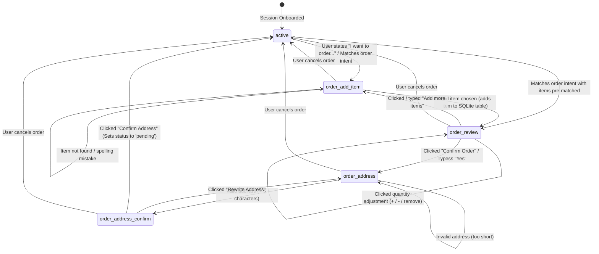
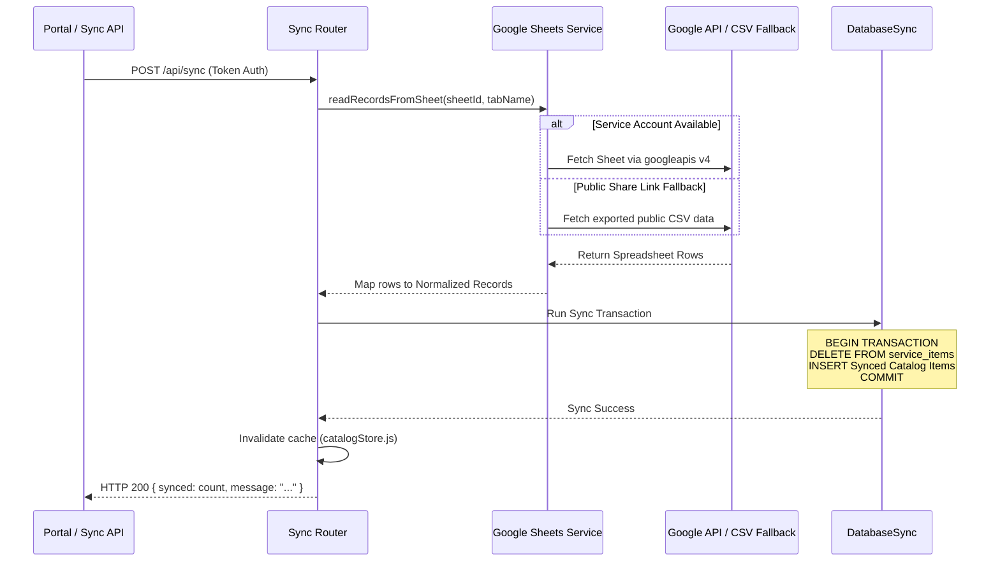

# AI Chatbot System - Architecture Map & Developer Guide

Welcome to the **Multi-Tenant Multi-Service Chatbot System** developer mapping document. This file acts as a technical blueprint for human developers and future AI coding agents. It provides a complete map of the codebase, explains the mechanics of all files, diagrams the operational workflows, and highlights design decisions.

---

## 1. System Architecture Overview

The system is a self-contained, multi-tenant conversational chatbot API built with **Node.js, Express, and SQLite (`node:sqlite`)**. It provides automated support, transactional item ordering, and human-handover live chat for small-to-medium businesses across three core industries (verticals):
1. **Cafes / Restaurants** (supporting full cart compilation, item adjustments, and delivery address verification)
2. **Clinics / Medical Practices** (handling bookings and doctor schedule lookups)
3. **Real Estate Agencies** (filtering listings by size, price, location, asset type, and specifications)

### High-Level Architecture Diagram

```mermaid
graph TD
    User([End-User / Website Widget]) <-->|HTTPS / JSON / WebSocket / long-poll| Widget[widget.js]
    Widget <-->|API Endpoints| Server[server.js]
    
    subgraph Express Routing Layer [Express API & Router Layer]
        Server -->|/api/init| InitRouter[api/init.js]
        Server -->|/api/message| MsgRouter[api/message.js]
        Server -->|/api/sync| SyncRouter[api/sync.js]
        Server -->|/portal/api| PortalRouter[portal.js]
        Server -->|/dashboard/...| DashRouter[dashboard sub-routers]
    end

    subgraph Auth & Access [Security Middleware]
        tokenValidator[tokenValidator.js] -.->|Secures tenant requests| MsgRouter
        tokenValidator -.->|Secures sync requests| SyncRouter
        authMiddleware[auth.js] -.->|Secures dashboard views| DashRouter
    end

    subgraph Core Heuristic NLP Engine [NLP & Translation Engine]
        MsgRouter -->|Detect & Translate| Detector[detector.js]
        MsgRouter -->|Arabic-to-English Mapping| Translator[translation.js]
        MsgRouter -->|Phonetic / Franco Recovery| Franco[franco.js]
        MsgRouter -->|Fuzzy Correction| QueryRecovery[queryRecovery.js]
    end

    subgraph Intent & State Machines [Conversation Controllers]
        MsgRouter -->|Domain Logic Routing| BrainsRouter[brains/index.js]
        BrainsRouter -->|Domain Intent Detection| CafeBrain[brains/cafe.js]
        BrainsRouter -->|Domain Intent Detection| ClinicBrain[brains/clinic.js]
        BrainsRouter -->|Domain Intent Detection| REBrain[brains/realEstate.js]
        
        MsgRouter -->|Cart State Machine| OrderFlow[engine/orderFlow.js]
    end

    subgraph Storage & Sync [Data Access & Synchronization]
        CafeBrain & ClinicBrain & REBrain & OrderFlow -->|Read Catalog / Update State| DB[db/db.js SQLite]
        SyncRouter & PortalRouter -->|Sync Sheets to DB| GSheets[services/googleSheets.js]
        GSheets -->|Google API / CSV Fetch| GoogleSheetsAPI([Google Sheets Cloud])
    end
    
    style Server fill:#1b4d3e,stroke:#fff,stroke-width:2px,color:#fff
    style Core Heuristic NLP Engine fill:#2e5c8a,stroke:#fff,stroke-width:2px,color:#fff
    style Intent & State Machines fill:#805a3c,stroke:#fff,stroke-width:2px,color:#fff
    style Storage & Sync fill:#7c2d12,stroke:#fff,stroke-width:2px,color:#fff
```

---

## 2. Global Database Schema Map

The SQLite database (`chatbot.db`) is configured with write-ahead logging (**WAL mode**), normal disk synchronization, and cascade deletes for maximum performance.

```sql
PRAGMA journal_mode = WAL;
PRAGMA synchronous = NORMAL;
PRAGMA foreign_keys = ON;
```

### Table Dictionary

#### 1. `admins`
Stores backend administrators managing all tenants or specific tenants.
- `id` (INTEGER, PK, AUTOINCREMENT)
- `username` (TEXT, UNIQUE, NOT NULL): Login ID.
- `password` (TEXT, NOT NULL): Bcrypt-hashed.
- `role` (TEXT, DEFAULT 'user'): Access level (`admin` or `user`).
- `business_id` (INTEGER, NULLABLE REFERENCES `businesses(id)`): Restricts dashboard users to a single tenant.
- `created_at` (TEXT, DEFAULT Current Timestamp)

#### 2. `businesses`
The tenant configuration table. Each row is a distinct chatbot client (e.g., a specific coffee shop or clinic).
- `id` (INTEGER, PK, AUTOINCREMENT)
- `token` (TEXT, UNIQUE, NOT NULL): The authorization token used by client widgets to authenticate requests.
- `service_type` (TEXT, DEFAULT 'cafe'): Defines the brain used (`cafe`, `clinic`, `realestate`).
- `name` (TEXT, NOT NULL) / `name_ar` (TEXT): Bilingual tenant names.
- `primary_color` (TEXT) / `secondary_color` (TEXT): Theme color hexes dynamically applied to the widget UI.
- `logo_url` (TEXT): Brand image url.
- `about_en` (TEXT) / `about_ar` (TEXT): Static bio/about text.
- `phone` (TEXT) / `email` (TEXT) / `address_en` (TEXT) / `address_ar` (TEXT): Contact variables.
- `working_hours_en` (TEXT) / `working_hours_ar` (TEXT): Custom schedule declarations.
- `catalog_link` (TEXT): Menu link or brochure link.
- `drive_folder_id` (TEXT) / `sheet_id` (TEXT) / `sheet_name` (TEXT): Settings for Google Sheets synchronization.
- `welcome_en` (TEXT) / `welcome_ar` (TEXT): Custom initial greeting message.
- `suggestions_en` (TEXT) / `suggestions_ar` (TEXT): JSON arrays of quick-reply suggestion chips.
- `active` (INTEGER, DEFAULT 1): Active/suspended flag.
- `created_at` (TEXT)

#### 3. `service_items`
Holds catalog data synchronized from Google Sheets or entered via management APIs.
- `id` (INTEGER, PK, AUTOINCREMENT)
- `business_id` (INTEGER, REFERENCES `businesses(id)` ON DELETE CASCADE)
- `service_type` (TEXT, DEFAULT 'cafe'): Matches business type.
- `title_en` (TEXT, NOT NULL) / `title_ar` (TEXT): Item names.
- `category_en` (TEXT) / `category_ar` (TEXT): Grouping variables (e.g., "Hot Drinks", "Apartments").
- `description_en` (TEXT) / `description_ar` (TEXT): Long details.
- `price` (REAL): Float value for ordering or listing prices.
- `currency` (TEXT, DEFAULT 'EGP'): Target currency.
- `metadata` (TEXT, DEFAULT '{}'): JSON string containing schema-free custom attributes (e.g., `sizes`, `district`, `asset_type`, `specifications`).
- `available` (INTEGER, DEFAULT 1): Availability flag.
- `created_at` (TEXT)

#### 4. `sessions`
Tracks active user conversations and captures state variables.
- `id` (INTEGER, PK, AUTOINCREMENT)
- `session_key` (TEXT, UNIQUE, NOT NULL): Conversation tracking ID.
- `business_id` (INTEGER, REFERENCES `businesses(id)` ON DELETE CASCADE)
- `guest_name` (TEXT): Saved name collected during onboarding.
- `guest_phone` (TEXT): Saved phone number collected during onboarding.
- `automated` (INTEGER, DEFAULT 1): Handover toggle. If `0`, automatic NLP parsing is bypassed, routing inputs straight to the live agent dashboard.
- `language` (TEXT, DEFAULT 'en'): Detected/chosen language (`ar` or `en`).
- `ip` (TEXT): User's IP address.
- `phase` (TEXT, DEFAULT 'collect_name'): Position in onboarding flow (`collect_name`, `collect_phone`, `active`, `order_review`, `order_add_item`, `order_address`, `order_address_confirm`).
- `context` (TEXT, DEFAULT '{}'): State JSON containing previous items, last matched categories, and active order properties.
- `created_at` (TEXT)
- `last_active` (TEXT): Used to calculate session expiration.

#### 5. `messages`
Audit trail of all conversation statements.
- `id` (INTEGER, PK, AUTOINCREMENT)
- `session_id` (INTEGER, REFERENCES `sessions(id)` ON DELETE CASCADE)
- `role` (TEXT): `user` or `bot`.
- `content` (TEXT): The message text.
- `intent` (TEXT): Stored classification identifier (e.g., `greeting_hello`, `item_price`, `admin_manual`).
- `created_at` (TEXT)

#### 6. `orders`
Represents cafe draft and completed orders.
- `id` (TEXT, PRIMARY KEY): Unique string tracking key.
- `business_id` (INTEGER, REFERENCES `businesses(id)` ON DELETE CASCADE)
- `session_id` (INTEGER, REFERENCES `sessions(id)` ON DELETE SET NULL)
- `guest_name` (TEXT)
- `guest_phone` (TEXT, NOT NULL)
- `status` (TEXT, DEFAULT 'draft'): Order lifecycle stage (`draft`, `awaiting_address`, `address_confirmation`, `pending`, `completed`, `cancelled`).
- `address` (TEXT): Collected delivery address.
- `confirmed_at` (TEXT)
- `created_at` (TEXT)
- `updated_at` (TEXT)

#### 7. `order_items`
Many-to-many relationship connecting orders to specific catalog service items.
- `id` (INTEGER, PK, AUTOINCREMENT)
- `order_id` (TEXT, REFERENCES `orders(id)` ON DELETE CASCADE)
- `service_item_id` (INTEGER, REFERENCES `service_items(id)` ON DELETE SET NULL)
- `title_en` (TEXT, NOT NULL) / `title_ar` (TEXT)
- `quantity` (INTEGER, DEFAULT 1)
- `unit_price` (REAL)
- `currency` (TEXT, DEFAULT 'EGP')
- `created_at` (TEXT)
- `updated_at` (TEXT)

---

## 3. Heuristic NLP & Query Processing Flow

This backend uses a highly optimized, dependency-free local NLP engine that maps user queries to intents and catalog products without relying on heavy external machine learning libraries.

### Query Ingestion & Processing Pipeline

```
  [User Message]
         │
         ▼
[Language Detection] ──► Sets state.language = 'ar' or 'en'
         │
         ▼
[Digit Normalization] ──► Maps Arabic digits (٠-٩) to English digits (0-9)
         │
         ▼
[Regular Intent Matching] ──► Tests against Regex Patterns (hello, contact, hours)
         │
    Matches? ───[YES]───► Return Response Payload
         │
       [NO]
         │
         ▼
[Catalog Matcher (Direct)] ──► Compiles score using title/category variants
         │
   Score >= Threshold? ───[YES]───► Return Matched Item / Intent
         │
       [NO]
         │
         ▼
[Arabic-to-English Dictionary] ──► Replaces common Arabic tokens with English equivalents
         │
    Intent Found? ───[YES]───► Return Matched Item
         │
       [NO]
         │
         ▼
[Franco-Arabic Phonetic Recovery] ──► Converts Latinized-Arabic (e.g., "ahwa" -> "coffee")
         │
    Intent Found? ───[YES]───► Return Matched Item
         │
       [NO]
         │
         ▼
[Levenshtein Distance Recovery] ──► Finds fuzzy spelling matches (e.g., "coffe" -> "coffee")
         │
    Intent Found? ───[YES]───► Return Matched Item
         │
       [NO]
         │
         ▼
  [Intent: unknown] ──► Output default fallback greeting / instructions
```

### Core Heuristic Files

*   **[`src/engine/detector.js`](file:///c:/Users/pc/ai-chatbot/src/engine/detector.js)**
    *   `detectLanguage(text)`: Scans for Arabic Unicode ranges (`\u0600-\u06FF`). If found, returns `'ar'`, otherwise `'en'`.
    *   `normalize(text, lang)`: Cleans inputs. Arabic strings undergo letter normalization (e.g., replacing `ة` with `ه`, strips diacritics/tashkeel). English strings are lowercased and stripped of special characters.
    *   `tokenize(text)`: Splits text into alphanumeric word chunks, filtering out empty entries.
    *   `normalizeArabicDigits(text)`: Replaces Arabic digits (`١`, `٢`, `٣`, etc.) with standard Arabic-Indic digits (`1`, `2`, `3`).

*   **[`src/engine/translation.js`](file:///c:/Users/pc/ai-chatbot/src/engine/translation.js)**
    *   Stores `ARABIC_TO_ENGLISH_DICT`, an extensive static translation mapping for Arabic words (e.g., `قهوة` -> `coffee`, `شقة` -> `apartment`, `دكتور` -> `doctor`).
    *   `translateArabicToEnglish(text)`: Iteratively matches full-word regex targets and replaces them, ensuring text context remains intact. Used as step #1 in query recovery.

*   **[`src/engine/franco.js`](file:///c:/Users/pc/ai-chatbot/src/engine/franco.js)**
    *   Provides phonetic transformation algorithms for **Franco-Arabic** (Arabizi) – Arabic written with the Latin alphabet using numbers for unique sounds (e.g., `3` for `ع`, `7` for `ح`, `2` for `ء`).
    *   Contains character-map configurations translating Arabizi character clusters back into English equivalents.
    *   `recoverFranco(text, items)`: Phonetically checks the input string against item attributes, returning the clean English equivalent when a clear pattern emerges.

*   **[`src/engine/queryRecovery.js`](file:///c:/Users/pc/ai-chatbot/src/engine/queryRecovery.js)**
    *   `levenshtein(a, b)`: Implements standard edit-distance calculations.
    *   `similarity(a, b)`: Calculates percentage distance based on edit actions.
    *   `recoverUserQuery(text, lang, businessId)`: Compiles the tenant catalog vocabulary (titles, categories, descriptions) and queries it using Levenshtein distance on English words, or token overlap ratios on Arabic words. Corrects spelling mistakes (e.g., "capucinno" to "cappuccino") dynamically.

---

## 4. Stateful Order Flow State Machine

For **Cafes**, the system features a robust, state-locked ordering engine managed in **[`src/engine/orderFlow.js`](file:///c:/Users/pc/ai-chatbot/src/engine/orderFlow.js)**. When a user requests to place an order, the session phase transitions from `'active'` into the `'order_*'` phases. In these phases, normal NLP is suspended or constrained to complete the transaction.

### State Transition Diagram



### Protocol Commands

The ordering flow communicates client-side interactions via special string payloads formatted as:
`__order__:<action>:<itemId>:<payload>`

The backend parses these commands using `parseOrderCommand(text)`:

1.  `__order__:inc:<item_id>`: Increments quantity of an item in the `order_items` database.
2.  `__order__:dec:<item_id>`: Decrements quantity. If quantity drops to `0`, the item is deleted from `order_items`.
3.  `__order__:remove:<item_id>`: Deletes the item immediately.
4.  `__order__:sync_cart:<json_array>`: Syncs the cart state array directly from client-side memory.
5.  `__order__:add_more`: Switches phase to `'order_add_item'` to request additional menu selections.
6.  `__order__:confirm`: Confirms the cart content and moves the state to `'order_address'`.
7.  `__order__:rewrite_address`: Resets current address variables, prompting the user for an update.
8.  `__order__:confirm_address`: Finalizes the order details, changes database status to `'pending'`, and returns a receipt.
9.  `__order__:cancel`: Aborts the order transaction, deletes draft data, and returns the session to the `'active'` phase.

---

## 5. Directory & File Dictionary

This section outlines the exact purpose and key exported components of every file in the codebase.

```
ai-chatbot/
│
├── server.js                        # System entrypoint, Express app configuration
├── widget.js                        # Standalone client widget bundle (CSS/HTML generation)
├── google-service-account.json     # Optional Service Account credentials for GSheets
│
├── dashboard/                       # Static front-end admin dashboard code
│   └── index.html                   # Dashboard UI entry
│
├── portal/                          # Static front-end tenant portal dashboard code
│   └── index.html                   # Portal UI entry
│
└── src/                             # Backend Application Code
    ├── db/
    │   ├── db.js                    # Database connection, migrations, legacy handlers
    │   └── schema.sql               # Database schema definition
    │
    ├── middleware/
    │   ├── auth.js                  # Dashboard route authentication (session-based)
    │   └── tokenValidator.js        # Tenant validation via HTTP query token / headers
    │
    ├── services/
    │   └── googleSheets.js          # Google API & Fallback CSV sheets importer
    │
    ├── engine/
    │   ├── detector.js              # Tokenizer, digit corrector, language identifier
    │   ├── franco.js                # Arabizi transliteration phonetics solver
    │   ├── intent.js                # Cafe-specific intent router
    │   ├── patterns.js              # Regular Expression patterns dictionary
    │   ├── queryRecovery.js         # Levenshtein spelling recovery algorithm
    │   ├── responder.js             # Cafe-specific conversation template generator
    │   ├── sessionLifecycle.js      # Session timeout and lifecycle reset engine
    │   ├── phoneValidator.js        # Phone normalization and validation
    │   └── orderFlow.js             # Cafe transactional ordering state machine
    │
    ├── brains/
    │   ├── index.js                 # Multi-brain registration router
    │   ├── cafe.js                  # Cafe domain brain
    │   ├── clinic.js                # Clinic domain brain
    │   ├── realEstate.js            # Real Estate domain brain
    │   └── shared/
    │       ├── catalogStore.js      # Memory cached catalog provider
    │       ├── commonResponses.js   # Onboarding & error dialogue templates
    │       └── matcher.js           # Multi-variant token similarity score engine
    │
    └── routes/
        ├── api/
        │   ├── init.js              # Endpoint: Init or resume widget session
        │   ├── message.js           # Endpoint: Primary conversation router
        │   └── sync.js              # Endpoint: Trigger sheet import for tenant
        │
        ├── dashboard/
        │   ├── auth.js              # Admin authentication router
        │   ├── businesses.js        # Business tenant management API
        │   ├── catalog.js           # Catalog view & Sheets sync router
        │   └── database.js          # Raw DB diagnostic explorer
        │
        └── portal.js                # API gateway endpoints for the Tenant Portal
```

---

### File Details

#### Root Directory
*   **[`server.js`](file:///c:/Users/pc/ai-chatbot/server.js)**
    *   *Purpose*: The core application entrypoint. Configures Express middleware, Rate Limiters, security headers (via Helmet), and wires up API router namespaces. Runs the HTTP server on port `3500` (or `process.env.PORT`).
*   **[`widget.js`](file:///c:/Users/pc/ai-chatbot/widget.js)**
    *   *Purpose*: Front-end widget JavaScript file. Clients embed this script tag on their websites (e.g. `/widget.js?token=xyz`). It dynamically injects a stylish, modern, floating chat widget into the DOM, manages persistent storage in `localStorage`, and handles API communication with the `/api/init` and `/api/message` endpoints.

#### `src/db/`
*   **[`src/db/db.js`](file:///c:/Users/pc/ai-chatbot/src/db/db.js)**
    *   *Purpose*: Connects to the SQLite database via `node:sqlite` (DatabaseSync). Reads and executes `schema.sql` to initialize tables, runs database schemas migrations, and automates legacy catalog migrations (converting `cafes` to generic `businesses`). Exports the `db` wrapper.
*   **[`src/db/schema.sql`](file:///c:/Users/pc/ai-chatbot/src/db/schema.sql)**
    *   *Purpose*: The absolute relational blueprint. Creates the index structures and the tables: `admins`, `businesses`, `service_items`, `sessions`, `messages`, `orders`, and `order_items`.

#### `src/middleware/`
*   **[`src/middleware/auth.js`](file:///c:/Users/pc/ai-chatbot/src/middleware/auth.js)**
    *   *Purpose*: Session-based Express middleware for dashboard admin authentication. Restricts dashboard API endpoints to logged-in administrators.
*   **[`src/middleware/tokenValidator.js`](file:///c:/Users/pc/ai-chatbot/src/middleware/tokenValidator.js)**
    *   *Purpose*: Tenant authentication middleware. Extracts tokens from request headers (`x-business-token`), authorization tokens, or URL query parameters, looks up the corresponding business in the database, and attaches it to the request object (`req.business`).

#### `src/services/`
*   **[`src/services/googleSheets.js`](file:///c:/Users/pc/ai-chatbot/src/services/googleSheets.js)**
    *   *Purpose*: Handles data ingestion from Google Sheets.
    *   *Mechanics*: Attempts authorization using Google APIs and service account files (`google-service-account.json`). If no service account is found, it falls back to parsing public spreadsheets exported as CSV files (`https://docs.google.com/spreadsheets/d/.../gviz/tq?tqx=out:csv`). Normalizes row headers using regex and maps columns.

#### `src/engine/`
*   **[`src/engine/detector.js`](file:///c:/Users/pc/ai-chatbot/src/engine/detector.js)**
    *   *Purpose*: Provides text normalization, tokenization, digit mapping, and language detection utilities.
*   **[`src/engine/patterns.js`](file:///c:/Users/pc/ai-chatbot/src/engine/patterns.js)**
    *   *Purpose*: Pattern definitions and translation response templates for the base intents (e.g. greetings, help, pricing requests, thanks, etc.).
*   **[`src/engine/phoneValidator.js`](file:///c:/Users/pc/ai-chatbot/src/engine/phoneValidator.js)**
    *   *Purpose*: Validates and normalizes Egyptian and international phone numbers. Replaces non-numeric characters and verifies phone digit rules.
*   **[`src/engine/sessionLifecycle.js`](file:///c:/Users/pc/ai-chatbot/src/engine/sessionLifecycle.js)**
    *   *Purpose*: Manages session timeout calculations (defaulting to 6 hours) and handles session state resets, restoring welcoming flows.
*   **[`src/engine/translation.js`](file:///c:/Users/pc/ai-chatbot/src/engine/translation.js)**
    *   *Purpose*: Provides bilingual translation functions and contains `ARABIC_TO_ENGLISH_DICT` for common Arabic query terms.
*   **[`src/engine/franco.js`](file:///c:/Users/pc/ai-chatbot/src/engine/franco.js)**
    *   *Purpose*: Solves Franco-Arabic (Arabizi) inputs using phonetic mappings, checking output candidate tokens against catalog item keywords.
*   **[`src/engine/queryRecovery.js`](file:///c:/Users/pc/ai-chatbot/src/engine/queryRecovery.js)**
    *   *Purpose*: Handles fuzzy query searches using Levenshtein distance calculations and word similarity matching.
*   **[`src/engine/intent.js`](file:///c:/Users/pc/ai-chatbot/src/engine/intent.js)**
    *   *Purpose*: Fallback logic classifying intents, categories, and single-item menu matches for Cafe domains.
*   **[`src/engine/responder.js`](file:///c:/Users/pc/ai-chatbot/src/engine/responder.js)**
    *   *Purpose*: Maps resolved Cafe intents and matched objects into final text and button suggestions.
*   **[`src/engine/orderFlow.js`](file:///c:/Users/pc/ai-chatbot/src/engine/orderFlow.js)**
    *   *Purpose*: Manages cafe carts, order commands, and delivery addresses.

#### `src/brains/`
*   **[`src/brains/index.js`](file:///c:/Users/pc/ai-chatbot/src/brains/index.js)**
    *   *Purpose*: Core brain registry. Maps `service_type` to the appropriate brain object.
*   **[`src/brains/cafe.js`](file:///c:/Users/pc/ai-chatbot/src/brains/cafe.js)**
    *   *Purpose*: Integrates Cafe-specific business rules, welcome messaging, intent classification, sheet-column parsing, and response templates.
*   **[`src/brains/clinic.js`](file:///c:/Users/pc/ai-chatbot/src/brains/clinic.js)**
    *   *Purpose*: Integrates Clinic-specific business rules. Extracted values map clinic metadata columns such as `doctor_name`, `specialty`, `visit_fees`, and `working_hours` to query intents.
*   **[`src/brains/realEstate.js`](file:///c:/Users/pc/ai-chatbot/src/brains/realEstate.js)**
    *   *Purpose*: Manages complex real estate search requests. Compiles filters across metadata keys like `listing_type` (sale vs rent), `asset_type` (villa, apartment, office), `specs` (bedrooms, bathrooms, area), `pricing`, `location`, `compound`, and `district`.

#### `src/brains/shared/`
*   **[`src/brains/shared/catalogStore.js`](file:///c:/Users/pc/ai-chatbot/src/brains/shared/catalogStore.js)**
    *   *Purpose*: Memory-cache provider for tenant catalog databases, caching results for 5 minutes (`CACHE_TTL`).
*   **[`src/brains/shared/commonResponses.js`](file:///c:/Users/pc/ai-chatbot/src/brains/shared/commonResponses.js)**
    *   *Purpose*: Stores onboarding dialogs (e.g. request name, request phone, error messaging) in English and Arabic.
*   **[`src/brains/shared/matcher.js`](file:///c:/Users/pc/ai-chatbot/src/brains/shared/matcher.js)**
    *   *Purpose*: Implements the token similarity scorer used across brains to match items by title, category, and metadata columns.

#### `src/routes/`
*   **[`src/routes/api/init.js`](file:///c:/Users/pc/ai-chatbot/src/routes/api/init.js)**
    *   *Purpose*: Handles session initiation or session resumes when the widget loads. Returns brand properties, conversation history, suggestions, and current cart state.
*   **[`src/routes/api/message.js`](file:///c:/Users/pc/ai-chatbot/src/routes/api/message.js)**
    *   *Purpose*: Core conversation API gateway. Directs inputs through onboarding, ordering, and heuristic NLP pipelines, returning responses to the user.
*   **[`src/routes/api/sync.js`](file:///c:/Users/pc/ai-chatbot/src/routes/api/sync.js)**
    *   *Purpose*: Triggers synchronization of a tenant's catalog sheet with the database.
*   **[`src/routes/portal.js`](file:///c:/Users/pc/ai-chatbot/src/routes/portal.js)**
    *   *Purpose*: API endpoints for the tenant dashboard (e.g. updating profile info, managing inventory catalogs manually, downloading orders as CSV, and live-chat handover controls).
*   **[`src/routes/dashboard/`](file:///c:/Users/pc/ai-chatbot/src/routes/dashboard/)**
    *   *Purpose*: Contains administrative sub-routes:
        *   `auth.js`: Handles session authentication and login/logout endpoints for admin users.
        *   `businesses.js`: Core CRUD operations for managing business tenants.
        *   `catalog.js`: Allows administrators to manage service items and manually trigger Google Sheets syncs.
        *   `database.js`: Read-only SQL explorer tool for diagnostics.

---

## 6. Multi-Tenant Brain Specifications & Data Schemas

Synchronized service items contain specific data schemas depending on the tenant's `service_type`. These schemas are stored in the `metadata` column of the `service_items` table.

### 1. Cafe / Restaurant Brain (`service_type = 'cafe'`)
*   **Expected Google Sheet Columns**:
    *   `Title EN`, `Title AR`, `Category EN`, `Category AR`, `Description EN`, `Description AR`, `Price`, `Currency`, `Sizes`, `Available`
*   **Metadata Layout**:
    ```json
    {
      "sizes": ["Small", "Medium", "Large"]
    }
    ```
*   **Intent Focus**: Matches specific menu items and categories. Integrates directly with the `orderFlow` state machine.

### 2. Clinic Brain (`service_type = 'clinic'`)
*   **Expected Google Sheet Columns**:
    *   `Title EN` (Doctor's name), `Title AR`, `Category EN` (Specialty), `Category AR`, `Description EN`, `Description AR`, `Price` (Visit fees), `Currency`, `Working Hours EN`, `Working Hours AR`, `Available`
*   **Metadata Layout**:
    ```json
    {
      "doctor_name_en": "Dr. Sarah Ahmed",
      "doctor_name_ar": "د. سارة أحمد",
      "specialty_en": "Dermatology",
      "specialty_ar": "جلدية",
      "visit_fees": 300,
      "working_hours_en": "Sat - Wed 5 PM to 9 PM",
      "working_hours_ar": "السبت - الأربعاء 5م إلى 9م"
    }
    ```
*   **Intent Focus**: Answers inquiries about doctor availability, booking requirements, specialties, and visit pricing.

### 3. Real Estate Brain (`service_type = 'realestate'`)
*   **Expected Google Sheet Columns**:
    *   `Title EN`, `Title AR`, `Category EN` (Project/Compound name), `Category AR`, `Description EN`, `Description AR`, `Price`, `Currency`, `Listing Type` (Sale/Rent), `Asset Type` (Apartment/Villa/Office), `Unit Type`, `Offer Type`, `Compound`, `District`, `Location`, `Area`, `Bedrooms`, `Bathrooms`, `Installments`, `Down Payment`, `Available`
*   **Metadata Layout**:
    ```json
    {
      "listing_type": "sale",
      "asset_type": "apartment",
      "unit_type": "Duplex",
      "offer_type": "Installment",
      "project_name": "Compound Zed",
      "compound": "Zed",
      "district": "Sheikh Zayed",
      "location": "Giza",
      "area": 180,
      "bedrooms": 3,
      "bathrooms": 2,
      "installments": "8 Years",
      "down_payment": 200000
    }
    ```
*   **Intent Focus**: Handles complex, multi-variable search queries. Filters properties by bedrooms, location, down payment constraints, rental terms, and size ranges.

---

## 7. Interactive Human Handover Logic

Each chat session begins in automatic mode (`automated = 1`). However, if the user asks a question the bot cannot resolve, or if a tenant administrator intervenes, the session can transition to human-agent mode.

```
                  ┌──────────────────────┐
                  │ Automated Bot Mode   │
                  │   automated = 1      │
                  └──────────┬───────────┘
                             │
            Admin Intervenes / Sends Message
            via Portal API /sessions/:id/messages
                             │
                             ▼
                  ┌──────────────────────┐
                  │   Human Agent Mode   │
                  │   automated = 0      │
                  └──────────┬───────────┘
                             │
                     Session Resets /
                   Client Refreshes Chat
                             │
                             ▼
                  ┌──────────────────────┐
                  │ Automated Bot Mode   │
                  │   automated = 1      │
                  └──────────────────────┘
```

1.  **Triggering Handover**:
    *   When an administrator views a session and sends a manual reply via the Portal API (`POST /portal/api/sessions/:id/messages`), the server runs:
        ```sql
        UPDATE sessions SET automated = 0 WHERE id = ?;
        ```
    *   It inserts a system notification message with the intent `'human_joined'`, which informs the client widget that a support representative has joined.
2.  **Bypassing the NLP Engine**:
    *   While `automated = 0`, the primary message router (`POST /api/message`) bypasses the NLP matching logic.
    *   Incoming messages are saved to the `messages` table, and the API returns a response payload of `null`. The live agent reads and responds to these messages in real time from the portal dashboard.
3.  **Restoring Automated Mode**:
    *   Automated support is restored when the guest clicks the **Start New Chat** button (circular arrows icon) in the widget header. This clears the session history and resets the session phase to `'collect_name'`.

---

## 8. Integration & Sync Protocols

### Google Sheets Synchronization Flow

The synchronization process populates the catalog database table (`service_items`) from a Google Sheet. It can be triggered via the dashboard, portal APIs, or the widget sync route.



*   **Caching Strategy**: Synced catalog items are cached in memory (`catalogStore.js`) for 5 minutes (`CACHE_TTL`). Modifying the catalog via sync or manual portal updates automatically clears this cache.

---

## 9. Key Extension Guidelines for Future Developers & AI Agents

When modifying or extending this codebase, adhere to the following principles:

1.  **Extending Service Verticals (New Brains)**:
    *   Create a new file in `src/brains/` (e.g. `automotive.js`).
    *   Define its static properties (`serviceType`, `defaultSheetName`) and implement the core functions: `getWelcomeMessage(business, lang)`, `mapSheetRecords(records)`, `detectIntent({ text, lang, business, context })`, and `buildResponse(intentResult, lang, business)`.
    *   Register the new brain in `src/brains/index.js`.
2.  **Maintaining the SQLite Adapter**:
    *   Write raw SQL queries compatible with standard SQLite. Avoid using ORM-specific operations.
    *   Perform bulk writes or schema updates inside transactions using the `db.transaction()` wrapper in `src/db/db.js` to prevent database locks.
3.  **Language and Transliteration Patterns**:
    *   Define regex patterns in both Arabic and English inside `src/engine/patterns.js` to ensure the chatbot remains bilingual.
    *   When adding new domain terms to the catalog, update the dictionary in `src/engine/translation.js` so spelling correction works as expected.
